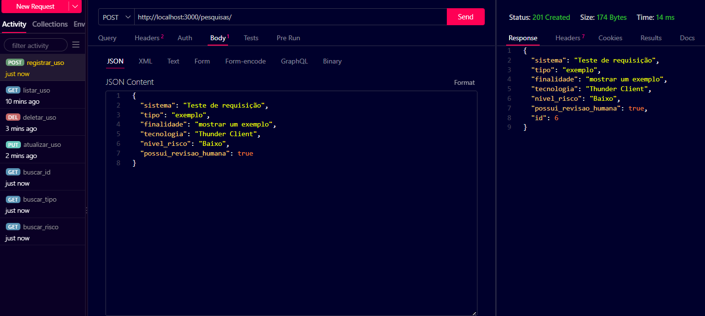
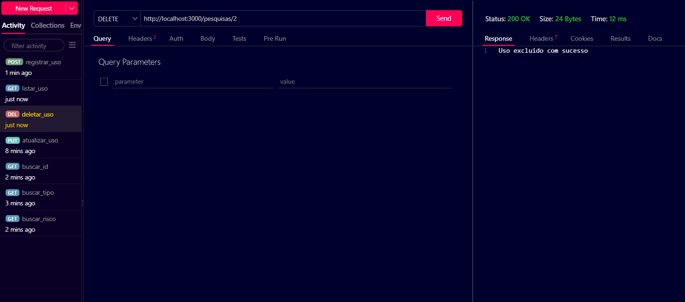
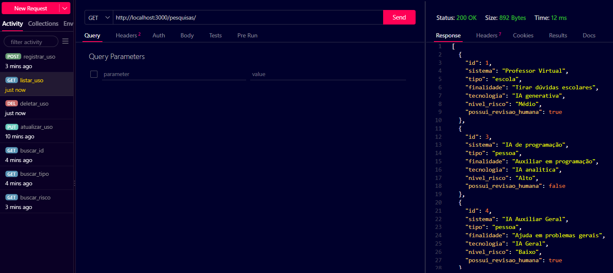
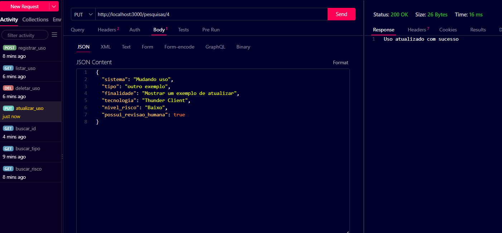
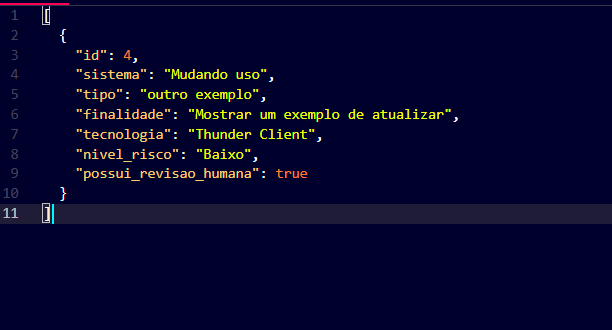
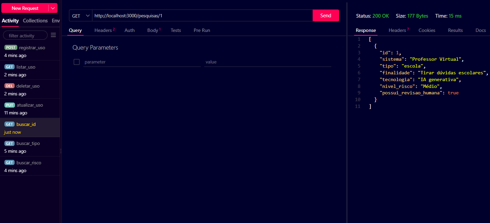
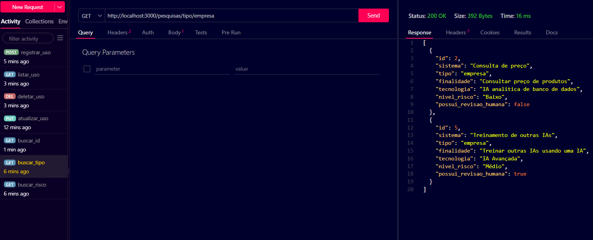
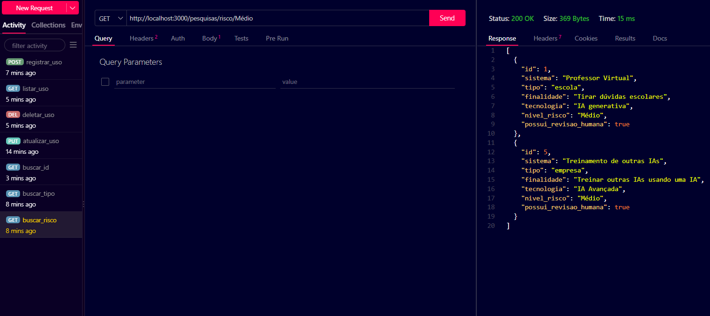

# Pesquisa de Campo Backend
## Descrição
Um pesquisador de Jaguariúna precisa de um banco de usos de IA, como aonde são usadas, quais suas finalidade, seus riscos e se há revisão humana.
## Tecnologias utilizadas
- Node.js
- JavaScript
- VsCode
- VsCode Thunder Cliente
## Como testar
Clone este repositório e abra com VsCode
Abra o terminal e digite
```
npm install
npm run dev
```
Teste as rotas utilizando a extensão Thunder Client do VsCode
Abra o arquivo client/index.html com a extensão Live Server do VsCode
## Prints dos testes e requisições
- Listar

- Cadastrar

- Deletar


- Atualizar


- Buscar ID

- Buscar Tipo

- Buscar Risco

